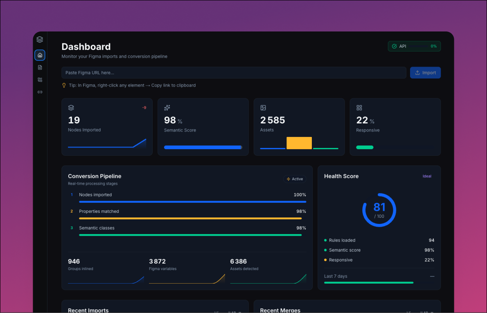

<p align="center">
  
</p>

<h1 align="center">Figma Code Export</h1>

<p align="center">
  <strong>Transform Figma designs into production-ready code.</strong><br>
  Platform agnostic. Responsive by design. 100% local.
</p>

<p align="center">
  <a href="#features">Features</a> •
  <a href="#node-explorer">Node Explorer</a> •
  <a href="#clean-code-export">Clean Code</a> •
  <a href="#export-options">Export</a> •
  <a href="#responsive-merge">Responsive Merge</a> •
  <a href="#quick-start">Quick Start</a> •
  <a href="docs/INSTALLATION.md">Installation</a> •
  <a href="docs/USAGE.md">Usage</a> •
  <a href="docs/FAQ.md">FAQ</a>
</p>

<p align="center">
  
  
  
  
  
</p>


---

## Why Figma Code Export?

**Stop copying CSS by hand.** Import your Figma designs and get clean, semantic code in seconds.

| Problem | Solution |
|---------|----------|
| Manual CSS extraction is slow | One-click import from Figma URL |
| Designs don't match code | High-fidelity output (colors, spacing, typography) |
| Responsive requires 3x work | **Merge 3 breakpoints → 1 component** |
| Vendor lock-in | Platform agnostic, multiple export formats |
| Cloud privacy concerns | **100% local** — your designs never leave your machine |

---

## Features

- **Multi-format export** — React/Tailwind, Tailwind v4, HTML/CSS (extensible)
- **Responsive merge** — Combine mobile + tablet + desktop into one component
- **Live preview** — See rendered output with breakpoint simulation
- **Rule engine** — Customize how Figma properties map to code
- **Node library** — Save, organize, and manage imported designs
- **Offline-first** — Fetch once, work offline forever

---

## Node Explorer

Browse your Figma designs like in Figma itself. Expand layers, inspect properties, see the hierarchy.

<p align="center">
  
</p>

- **Tree navigation** — Expand/collapse layers like in Figma
- **Click to select** — Code updates dynamically based on selected node
- **Search & filter** — Find any node instantly
- **Visual hierarchy** — See parent-child relationships

---

## Detail Panel

Inspect every Figma property. See exactly what will be exported.

<p align="center">
  
</p>

- **All Figma properties** — Fills, strokes, effects, typography
- **Computed styles** — See the final CSS output
- **Figma Variables** — Automatically mapped to CSS custom properties
- **Constraints info** — Understand layout behavior

---

## Clean Code Export

Generate production-ready code that's actually readable. No bloated CSS, no unnecessary wrappers.

<p align="center">
  
</p>

- **Semantic class names** derived from Figma layer names
- **Tailwind utilities** mapped from Figma properties
- **Monaco Editor** — Syntax highlighting, copy to clipboard
- **TypeScript or JavaScript** — Choose your language

---

## Export Options

### Simple Export

Export any node as a standalone component.

<p align="center">
  
</p>

- **Single file** — Just the code
- **ZIP package** — Code + assets + Vite project ready to run (`npm install && npm run dev`)

### Split into Components

For complex designs, split into multiple React components with proper imports.

- **Select nodes** to extract as separate components
- **Auto-generate imports** in the wrapper component
- **Maintain hierarchy** — Components reference each other correctly

---

## Dashboard

Track your imports, manage your library, monitor API usage.

<p align="center">
  
</p>

- **Import metrics** with 7-day sparkline trends
- **Semantic score** — Track code quality
- **API quota monitoring** — Never hit rate limits
- **Recent imports & merges** carousels

---

## Quick Start

```bash
git clone https://github.com/vincegx/Figma-Code-Export.git
cd Figma-Code-Export
npm install
```

```bash
# Add your Figma API token
cp .env.local.example .env.local
# Edit .env.local → FIGMA_ACCESS_TOKEN=your_token
```

```bash
npm run dev
# Open http://localhost:3000
```

**Get your Figma token:** [Figma Settings → Personal Access Tokens](https://www.figma.com/settings) → Generate new token

📖 **Full guide:** [docs/INSTALLATION.md](docs/INSTALLATION.md)

---

## Responsive Merge

The killer feature. Import 3 Figma frames and merge them into **one responsive component**.

<p align="center">
  
</p>

### How it works

1. **Import** your mobile, tablet, and desktop frames
2. **Create merge** — assign each frame to a breakpoint
3. **Get code** — automatic Tailwind responsive classes

<p align="center">
  
</p>

### Before & After

```
BEFORE: 3 separate Figma frames
┌─────────┐  ┌───────────────┐  ┌─────────────────────┐
│ Mobile  │  │    Tablet     │  │       Desktop       │
│  375px  │  │     768px     │  │       1280px        │
└─────────┘  └───────────────┘  └─────────────────────┘
     ↓              ↓                    ↓
```

```jsx
// AFTER: 1 responsive component
<Hero
  className="
    p-4 md:p-8 lg:p-12
    text-sm md:text-base lg:text-xl
    flex-col md:flex-row
  "
/>
```

### The algorithm

- **Element matching** by layer name across breakpoints
- **Mobile-first** class generation (`base` → `md:` → `lg:`)
- **Visibility classes** for breakpoint-specific elements (`hidden lg:block`)
- **Style deduplication** — only outputs differences

📖 **Full guide:** [docs/USAGE.md#responsive-merge](docs/USAGE.md#responsive-merge)

---

## Export Formats

| Format | Status | Output |
|--------|--------|--------|
| React + Tailwind | ✅ | `.tsx` with Tailwind classes |
| React + Tailwind v4 | ✅ | `.tsx` with Tailwind v4 syntax |
| HTML + CSS | ✅ | `.html` + `.css` files |
| Vue + Tailwind | 🔜 | Coming soon |
| Svelte | 🔜 | Coming soon |

---

## Documentation

| Guide | Description |
|-------|-------------|
| [Installation](docs/INSTALLATION.md) | Setup, requirements, configuration |
| [Usage](docs/USAGE.md) | Import, export, merge, rules |
| [Technical](docs/TECHNICAL.md) | Architecture, API, extending |
| [FAQ](docs/FAQ.md) | Common questions & troubleshooting |

---

## Tech Stack

- **Framework:** Next.js 14 (App Router)
- **Language:** TypeScript 5.3+ (strict mode)
- **Styling:** Tailwind CSS 3.4+
- **UI Components:** Radix UI + shadcn/ui
- **Code Editor:** Monaco Editor
- **State:** Zustand
- **API:** Figma REST API v1

---

## Contributing

Contributions welcome! Please read the [contributing guidelines](CONTRIBUTING.md) first.

```bash
# Run tests
npm test

# Run linter
npm run lint

# Build for production
npm run build
```

---

## License

MIT © [vincegx](https://github.com/vincegx)

---

<p align="center">
  <sub>Built for the design-to-code community</sub>
</p>
